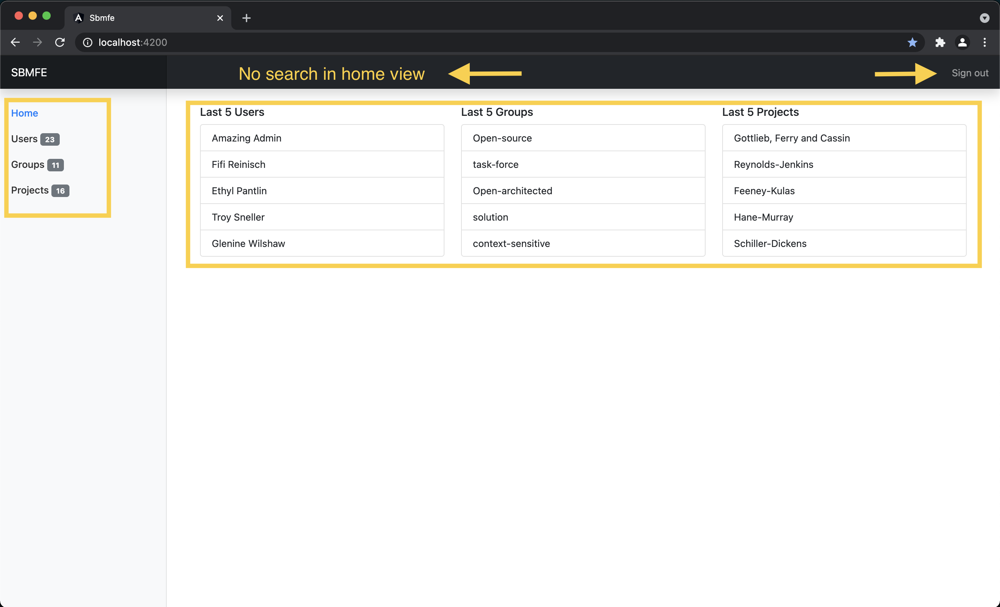
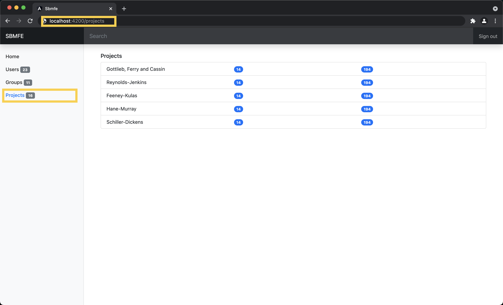
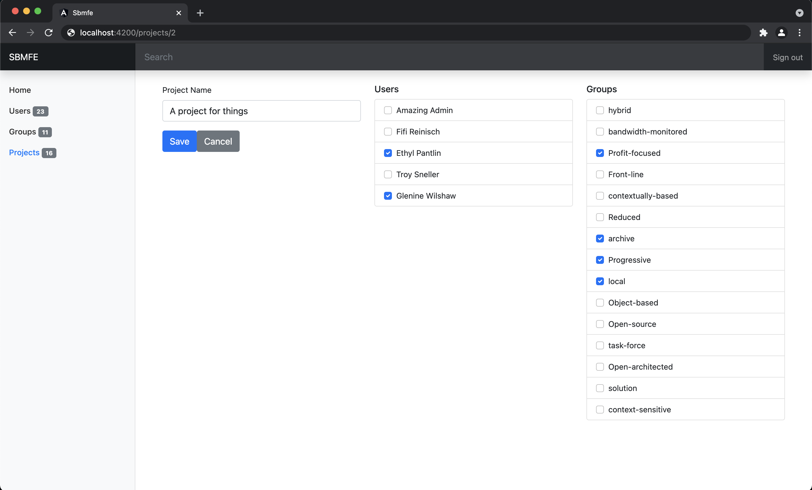

# Reference Screenshots

These are purely for reference purposes to provide an extra visual context of the outcome of the challenges and by no means the final visual outcome required from the code challenge.

# Home screen reference

- Search bar
- Sign out
- Selected navigation items
- Correct number of items in the sidenav
- List Items

# List page from Projects view screen reference

- Selected navigation item
- List view

# Details page from Projects view screen reference

- Form elements
- Action buttons. Save/Cancel
- Column layout
- List items with checkboxes
- Path with id. <view_path>/<ID>
